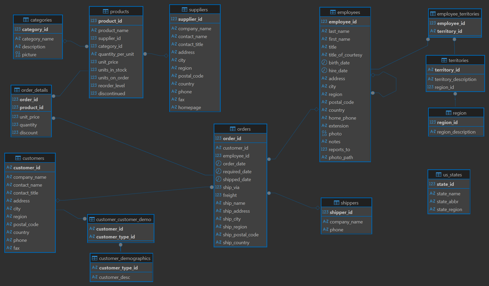

# NORTHWIND TRADERS PERFORMANCE ANALYSIS

## 📋 About the Northwind Database
The **Northwind** dataset is a sample database that represents a fictional specialty foods export-import company. It contains sales transaction data, customer profiles, product inventory, and supplier information. This project aims to extract actionable business insights using SQL queries and data exploration techniques.

## 🗺️ Entity-Relationship Diagram (ERD)
The database consists of 13 tables with complex relationships. Understanding these connections is crucial for performing deep-dive joins.


## 🚀 Business Analysis
### 1. 💰 Top 5 Products by Revenue
**Question:** Which products generate the highest financial contribution to the company?

<details>
  <summary>🔍 SQL Query</summary>

```sql
select
	p.product_name,
	c.category_name,
	SUM(od.quantity * od.unit_price * (1 - od.discount)) as total_revenue
from
	order_details od
join products p
on
	od.product_id = p.product_id
join categories c
on
	p.category_id = c.category_id
group by
	p.product_name,
	c.category_name
order by
	total_revenue desc
limit 5;
```

</details>

**Output:**
|product_name|category_name|total_revenue|
|------------|-------------|-------------|
|Côte de Blaye|Beverages|141396.73|
|Thüringer Rostbratwurst|Meat/Poultry|80368.67|
|Raclette Courdavault|Dairy Products|71155.70|
|Tarte au sucre|Confections|47234.97|
|Camembert Pierrot|Dairy Products|46825.48|

**💡 Insight:** 

**Côte de Blaye** is the primary revenue driver, contributing significantly more than other products. High-tier pricing in the *Beverages* and *Meat/Poultry* categories suggests these are the company's most profitable segments.

### 2. 📦 Top 5 Products by Sales Volume
**Question:** Which products are the most frequently sold in terms of quantity?

<details>
  <summary>🔍 SQL Query</summary>
  
```sql
select
	p.product_name,
	c.category_name,
	SUM(od.quantity) as total_quantity_sold
from
	order_details od
join products p
on
	od.product_id = p.product_id
join categories c
on
	p.category_id = c.category_id
group by
	p.product_name,
	c.category_name
order by
	total_quantity_sold desc
limit 5;
```
</details>

**Output:**
|product_name|category_name|total_quantity_sold|
|------------|-------------|-------------------|
|Camembert Pierrot|Dairy Products|1577|
|Raclette Courdavault|Dairy Products|1496|
|Gorgonzola Telino|Dairy Products|1397|
|Gnocchi di nonna Alice|Grains/Cereals|1263|
|Pavlova|Confections|1158|

**💡 Insight:** 

Products like **Camembert Pierrot** and **Raclette Courdavault** are sold in large quantities, showing that high-volume products are not always the highest revenue generators.

### 3. 👥 Top 5 Customers by Revenue
**Question:** Who are our most valuable clients (VVIP)?

<details>
  <summary>🔍 SQL Query</summary>

```sql
select
	c.company_name,
	SUM(od.quantity * od.unit_price * (1 - od.discount)) as total_revenue
from
	customers c
join orders o
on
	c.customer_id = o.customer_id
join order_details od
on
	o.order_id = od.order_id
group by
	c.company_name
order by
	total_revenue desc
limit 5;
```
</details>

**Output:**
|company_name|total_revenue|
|------------|-------------|
|QUICK-Stop|110277.30|
|Ernst Handel|104874.98|
|Save-a-lot Markets|104361.95|
|Rattlesnake Canyon Grocery|51097.80|
|Hungry Owl All-Night Grocers|49979.90|

**💡 Insight:** 

The top 3 customers contribute significantly (over $100k each). Maintaining a loyalty program for these "High Spender" accounts is vital for revenue stability.

### 4. 🌍 Customer Geographic Distribution
**Question:** Which countries have the highest concentration of customers?

<details>
  <summary>🔍 SQL Query</summary>

```sql
select
	country,
	COUNT(customer_id) as total_customers
from
	customers
group by
	country
order by
	total_customers desc
limit 5;
```
</details>

**Output:**
|country|total_customers|
|-------|---------------|
|USA|13|
|France|11|
|Germany|11|
|Brazil|9|
|UK|7|

**💡 Insight:** 

The **USA, France, and Germany** are our primary markets. Marketing campaigns should be localized for these regions to maximize engagement.

### 5. 🎖️ Employee Performance
**Question:** Which employees handle the highest volume of orders?

<details>
  <summary>🔍 SQL Query</summary>

```sql
select
	e.first_name || ' ' || e.last_name as employee_name,
	COUNT(o.order_id) as total_orders
from
	employees e
join orders o
on
	e.employee_id = o.employee_id
group by
	employee_name
order by
	total_orders desc
limit 5;
```
</details>

**Output:**
|employee_name|total_orders|
|-------------|------------|
|Margaret Peacock|156|
|Janet Leverling|127|
|Nancy Davolio|123|
|Laura Callahan|104|
|Andrew Fuller|96|

**💡 Insight:** 
Margaret Peacock is the most productive employee. Understanding her sales tactics could help in training other staff members to reach similar targets. 

### 6. 📈 Monthly Revenue Trend (1997)
**Question:** How did the revenue fluctuate throughout the year 1997?

<details>
  <summary>🔍 SQL Query</summary>

```sql
select
	extract(month from o.order_date) as month,
	SUM(od.quantity * od.unit_price * (1 - od.discount)) as monthly_revenue
from
	orders o
join order_details od
on
	o.order_id = od.order_id
where
	extract(year from o.order_date) = 1997
group by
	month
order by
	month;
```

</details>

**Output:**
|month|monthly_revenue|
|-----|---------------|
|1.0|61258.07|
|2.0|38483.63|
|3.0|38547.22|
|4.0|53032.95|
|5.0|53781.29|
|6.0|36362.80|
|7.0|51020.86|
|8.0|47287.67|
|9.0|55629.24|
|10.0|66749.22|
|11.0|43533.81|
|12.0|71398.43|

**💡 Insight:** 

Revenue peaked in October and December, likely due to seasonal demand. There is a noticeable dip in June; further investigation into seasonal promotions during mid-year is recommended.

### 7. 🏷️ Discount Impact Analysis
**Question:** Does offering discounts significantly increase the volume of goods sold?

<details>
  <summary>🔍 SQL Query</summary>

```sql
select
	p1.product_name as product_1,
	p2.product_name as product_2,
	COUNT(*) as times_bought_together
from
	order_details od1
join order_details od2 
    on
	od1.order_id = od2.order_id
	and od1.product_id < od2.product_id
join products p1 
    on
	od1.product_id = p1.product_id
join products p2 
    on
	od2.product_id = p2.product_id
group by
	p1.product_name,
	p2.product_name
order by
	times_bought_together desc
limit 5;
```

</details>

**Output:**
|discount_status|total_quantity|
|---------------|--------------|
|Non-Discounted|28599|
|Discounted|22718|

**💡 Insight:** 

Surprisingly, the volume of non-discounted items is higher. This suggests that Northwind customers may be less price-sensitive or that certain core products are frequently bought regardless of promotions.

### 8. 🤝 Product Affinity (Market Basket Analysis)
**Question:** Which products are frequently bought together?

<details>
  <summary>🔍 SQL Query</summary>

```sql
select
	p1.product_name as product_1,
	p2.product_name as product_2,
	COUNT(*) as times_bought_together
from
	order_details od1
join order_details od2 
    on
	od1.order_id = od2.order_id
	and od1.product_id < od2.product_id
join products p1 
    on
	od1.product_id = p1.product_id
join products p2 
    on
	od2.product_id = p2.product_id
group by
	p1.product_name,
	p2.product_name
order by
	times_bought_together desc
limit 5;
```

</details>

**Output:**
|product_1|product_2|times_bought_together|
|---------|---------|---------------------|
|Sir Rodney's Scones|Sirop d'érable|8|
|Pavlova|Gorgonzola Telino|7|
|Pavlova|Tarte au sucre|6|
|Camembert Pierrot|Flotemysost|6|
|Gorgonzola Telino|Mozzarella di Giovanni|6|

**💡 Insight:** 

Scones and Sirop d'érable are frequently paired. This is a perfect opportunity for cross-selling or creating "Bundle Deals" to increase the Average Order Value (AOV).

## 🏁 Conclusion
Through this SQL analysis, we can identified key revenue drivers, seasonal trends, and purchasing patterns. The insights gained from Product Affinity and Customer Segmentation provide a solid foundation for data-driven decision-making in inventory management and marketing strategies.

## 🛠️ Tech Stack & Tools
- **Database:** PostgreSQL
- **Analytical Tool:** DBeaver
- **Documentation:** Markdown & GitHub

##  ⚡️SQL Skills Demonstrated
- JOIN
- GROUP BY
- Aggregation (SUM, COUNT)
- CASE WHEN
- Date Functions
- Multi-table Analysis
